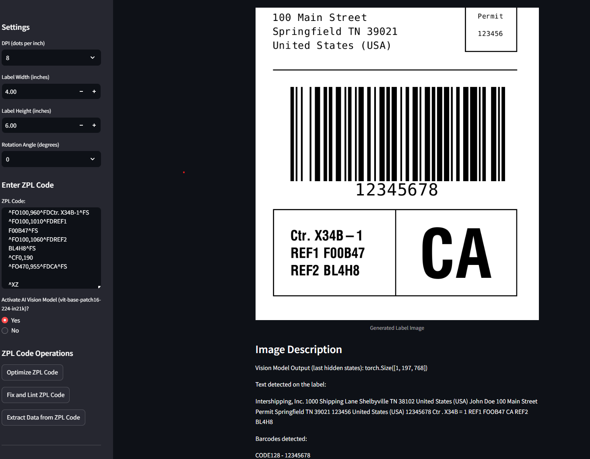

# WizPL

WizPL is a Streamlit app that processes, optimizes, fixes and display ZPL code. 

Optionally it can also run AI vision model to analyze label elements or to extract data with legacy OCR approach into a JSON structure. 

## Features

- Convert ZPL code to label images
- Rotate label images
- Extract text and barcodes from images
- Optimize, lint, and fix ZPL code
- Description of label elements (text and barcodes)
- AI vision model for image analysis (optional)

## Installation

To run this project, follow these steps:

1. Clone the repository:
   ```bash
   git clone https://github.com/th3pajay/wizpl.git

2. Install the required dependencies:

   ```bash
   pip install -r requirements.txt

3. Run the Streamlit app:

   ```bash
    streamlit run app.py

## Demo
https://wizpl1.streamlit.app/



### Example ZPL Code

```zpl
^XA
^FX Top section with logo, name, and address.
^CF0,60
^FO50,50^GB100,100,100^FS
^FO220,50^FDIntershipping, Inc.^FS
^CF0,30
^FO220,115^FD1000 Shipping Lane^FS
^FO220,155^FDShelbyville TN 38102^FS
^FO220,195^FDUnited States (USA)^FS
^FO50,250^GB700,3,3^FS

^FX Second section with recipient address and permit information.
^CFA,30
^FO50,300^FDJohn Doe^FS
^FO50,340^FD100 Main Street^FS
^FO50,380^FDSpringfield TN 39021^FS
^FO50,420^FDUnited States (USA)^FS
^CFA,15
^FO600,300^GB150,150,3^FS
^FO638,340^FDPermit^FS
^FO638,390^FD123456^FS
^FO50,500^GB700,3,3^FS

^FX Third section with barcode.
^BY5,2,270
^FO100,550^BC^FD12345678^FS

^FX Fourth section with boxes.
^FO50,900^GB700,250,3^FS
^FO400,900^GB3,250,3^FS
^CF0,40
^FO100,960^FDCtr. X34B-1^FS
^FO100,1010^FDREF1 F00B47^FS
^FO100,1060^FDREF2 BL4H8^FS
^CF0,190
^FO470,955^FDCA^FS
^XZ
